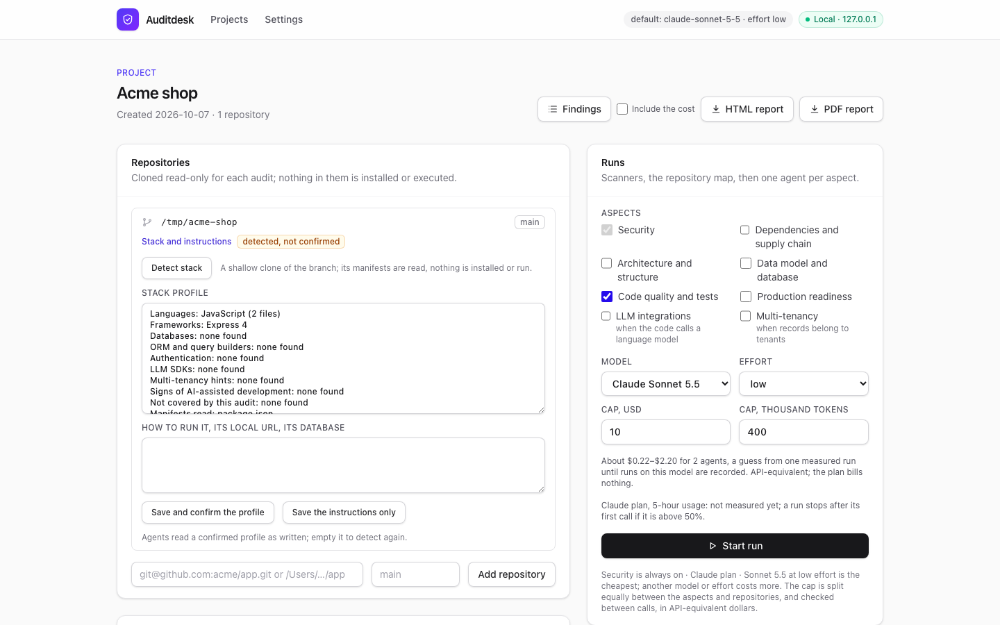
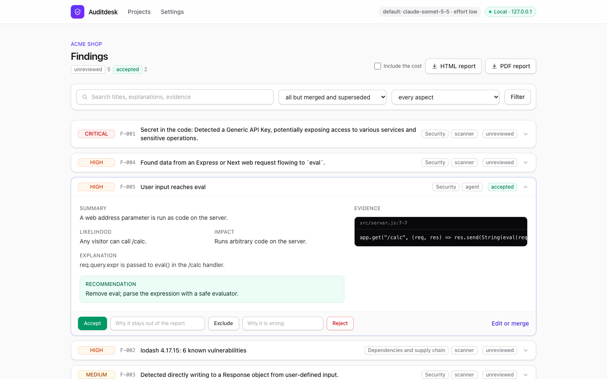
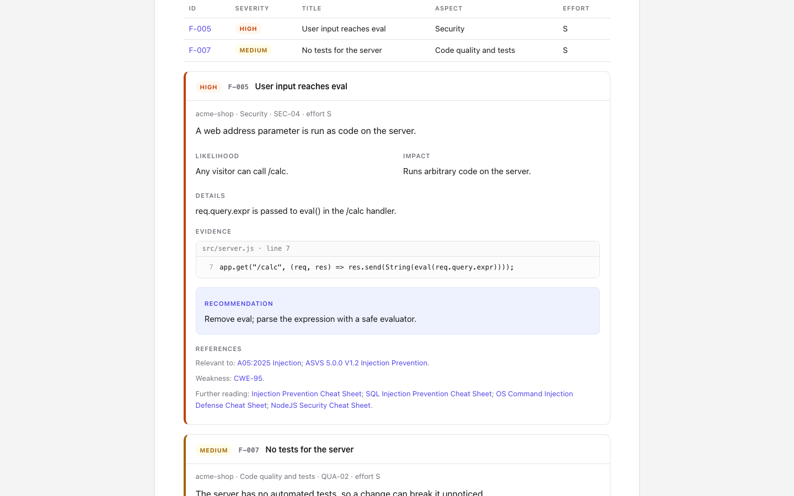
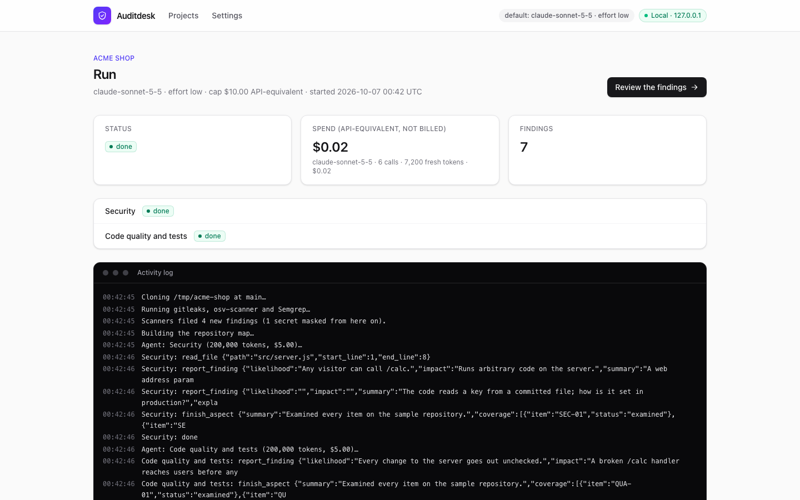

# Auditdesk

A local web app for auditing a client's codebase. It clones the repositories, runs
deterministic scanners, has Claude investigate each chosen aspect with read-only tools, lets the
auditor accept, edit or reject every finding, and exports a client-ready report as HTML and PDF.

Local only: it binds 127.0.0.1 and has no login. The design is in [docs/design.md](docs/design.md).



## What it does

- **Scanners first:** gitleaks over every branch's history, osv-scanner over the lock files and
  Semgrep, in pinned Docker images and on the app's own configuration. Every secret gitleaks
  finds is masked in everything the model or the client sees.
- **One agent per aspect:** security always, plus dependencies, architecture, data model, code
  quality and tests, production readiness, LLM integrations and multi-tenancy as chosen. Each
  works from a checklist with stable item IDs and reads the code through read-only tools.
- **Stack detection** from manifests and schemas, confirmed or edited by the auditor, suggests
  the conditional aspects; an AI-built mode adds checks for code written largely by AI tools.
- **Review:** accept, edit, merge, reject or exclude every finding; only accepted or edited ones
  reach the report. IDs (`F-012`) are never reused, and a reviewed finding keeps its ID through
  re-runs.
- **The report:** one self-contained HTML file with filters and search, and a PDF. A summary of
  what to fix before sign-off and what can wait, scope and coverage, each finding with its
  evidence, and links to the OWASP Top 10:2025, ASVS 5.0.0, CWE and Cheat Sheets it is relevant
  to.
- **Cost under control:** caps per run, split between agents; a pre-run estimate from past runs;
  every call priced by the model that served it.





## Stack

Next.js 16 (App Router), React 19, TypeScript, Tailwind CSS, PostgreSQL through Prisma 7, the
Anthropic SDK and the Claude Agent SDK, Playwright for the PDF and end-to-end tests, Vitest.

- **Next.js:** Server Components reading through a server-only data layer; every mutation a
  Server Action, and the forms that can be refused report back through `useActionState`; Route Handlers for downloads and Server-Sent Events;
  `proxy.ts` as a Host allowlist; `instrumentation.ts` starting the job runner.
- **PostgreSQL:** a job queue claimed with `FOR UPDATE SKIP LOCKED`; live progress through
  `LISTEN`/`NOTIFY`; JSONB evidence; full-text search over findings; partial indexes, one of them
  unique so a double click cannot start two runs.

## Setup

You need Node 22 or later, pnpm 10 (through Corepack), Docker, and for Claude plan access the
`claude` CLI.

```bash
cp .env.example .env.local
pnpm install
pnpm exec playwright install chromium
git config core.hooksPath .githooks
pnpm db:up
pnpm db:deploy
pnpm dev
```

Set `AUDITOR_NAME` in `.env.local`: it is the name on the report's cover, and without it the
report names no auditor. The PDF export prints through the Chromium that Playwright installs.
Docker runs PostgreSQL and the scanners. The app opens at http://127.0.0.1:3000.

## Model access

Each project runs on one of two engines, chosen under "Model access" on its page. A new project
starts on the Claude plan.

- **API key:** the Messages API, billed per token under Anthropic's Commercial Terms. Put the key
  in `.env.local` as `ANTHROPIC_API_KEY` or save it in Settings.
- **Claude plan:** the Claude Agent SDK on your own Claude subscription, for your own audits. Run
  `claude setup-token`, then put the token in `.env.local` as `CLAUDE_CODE_OAUTH_TOKEN` or save it
  in Settings. Usage counts against your plan's limits; the run page shows API-equivalent
  dollars, not a bill.

A value in `.env.local` wins over a saved one. Saved values live in
`~/.auditdesk/credentials.json` (mode 0600), never in the database. The Agent SDK session gets
the app's seven tools (five read the clone, two file findings and coverage) and nothing else: no
built-in tools, no settings, hooks, skills or MCP servers from the clone or from `~/.claude`.

A Claude plan run keeps half of the plan's 5-hour window in reserve. The engine saves the last
reading the plan reports to `~/.auditdesk/plan-usage.json`; above 50% a run starts only with
"Allow past the 50% reserve" ticked, and a run that crosses 50% stops after that turn. A call
paid by extra usage stops the agent in any case.



## Tests

```bash
pnpm test        # Vitest: logic, against a test database
pnpm test:e2e    # Playwright: the built app, with the model and the scanners replayed
```

Neither calls the API: recorded model responses and scanner outputs are replayed, so CI needs no
key and no scanner images. `AUDITDESK_SCREENSHOTS=1 pnpm test:e2e -g screenshots` retakes the
screenshots above from a replayed run on a sample repository.

## Evals

Auditdesk's own fixture, a small Next.js storefront platform with defects planted for every
aspect, is a separate repository, to be published alongside this one; its answer key is in
`evals/answers/`. The harness and the first scores, by model and effort, come next and will be
quoted here.

## Live checks

`pnpm tsx scripts/smoke.mts` sends two small requests with the agent's exact request shape and
prints each response's model, stop reason and usage. It needs `ANTHROPIC_API_KEY` in
`.env.local` and costs a few cents.

`pnpm tsx scripts/smoke-sdk.mts` sends one aspect agent through the SDK engine on the plan token
and prints its outcome, its calls and the plan's 5-hour usage.

## Security of the tool

Bound to 127.0.0.1 with no login. `proxy.ts` allows only a `Host` of localhost or 127.0.0.1, which
stops DNS rebinding; every mutation is a Server Action, which Next.js accepts only by POST from
its own origin; Route Handlers are GET only and change no data (a report download keeps a copy
beside the clones, and refuses a request another site started); PostgreSQL is published on
127.0.0.1 only. The client's code is never installed, built or run, and a pre-commit hook runs
gitleaks on the staged files.

## License

MIT
